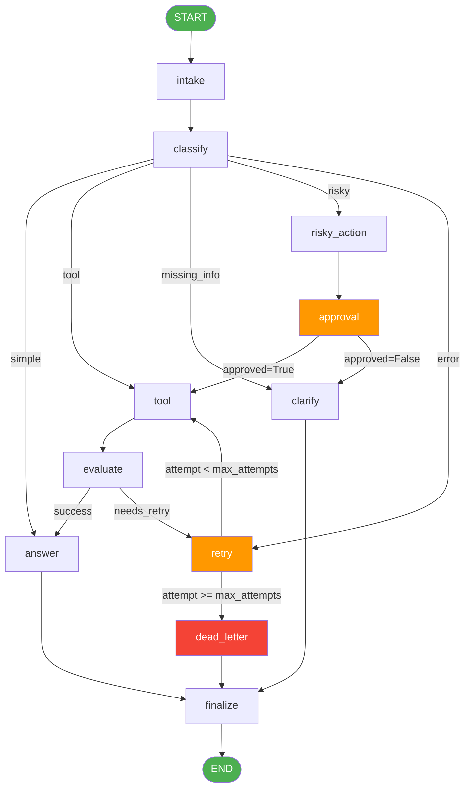

# Graph Diagram — Day 08 LangGraph Agent

## Mermaid Diagram



## ASCII Flow

```
START
  │
  ▼
[intake] ──── normalize query, emit audit event
  │
  ▼
[classify] ── keyword heuristics → route, risk_level
  │
  ├─── simple ──────────────────────────────────────────────►[answer]──►[finalize]──►END
  │                                                                              ▲
  ├─── missing_info ─────────────────────────────────────►[clarify]──────────────┤
  │                                                                               │
  ├─── risky ──►[risky_action]──►[approval]──approved──►[tool]──►[evaluate]──────┤
  │                                       └──rejected──►[clarify]                │
  │                                                                               │
  ├─── tool ────────────────────────────►[tool]──►[evaluate]─success────►[answer]┤
  │                                                   │                          │
  │                                           needs_retry                        │
  │                                                   ▼                          │
  └─── error ──────────────────────────►[retry]◄──────┘                         │
                                            │   attempt < max_attempts ──►[tool] │
                                            │   attempt >= max_attempts          │
                                            └──►[dead_letter]────────────────────┘
```

## Node Count: 11

| Node | Route | Description |
|------|-------|-------------|
| intake | all | Normalize + audit |
| classify | all | Keyword-based routing |
| answer | simple, tool, risky | Generate grounded response |
| tool | tool, risky, error | Mock tool execution |
| evaluate | tool, risky, error | "Done?" check for retry loop |
| clarify | missing_info, rejected | Targeted clarification question |
| risky_action | risky | Prepare action + risk justification |
| approval | risky | HITL mock / real interrupt() |
| retry | error | Increment attempt counter |
| dead_letter | error (max exceeded) | Escalate for manual review |
| finalize | all | Final audit event |

## State Reducer Summary

| Field | Reducer | Rationale |
|-------|---------|-----------|
| events | **append** | Full chronological audit trail |
| messages | **append** | Conversation history |
| tool_results | **append** | All tool calls preserved for grounding |
| errors | **append** | All errors preserved for analysis |
| route | overwrite | Only current route needed for routing |
| attempt | overwrite | Current counter drives loop bound |
| evaluation_result | overwrite | Latest eval decision drives routing |
| final_answer | overwrite | Latest answer supersedes previous |

## Key LangGraph Patterns Used

1. **Conditional edges** (`route_after_classify`, `route_after_evaluate`, etc.) — pure functions, no side effects
2. **Retry loop** — `tool → evaluate → retry → tool` bounded by `max_attempts` in state
3. **HITL interrupt** — `approval_node` calls `interrupt()` when `LANGGRAPH_INTERRUPT=true`
4. **Checkpointer** — MemorySaver (default) or SqliteSaver (extension) for crash-resume
5. **Append-only reducers** — `events` list accumulates full audit trail for time-travel
